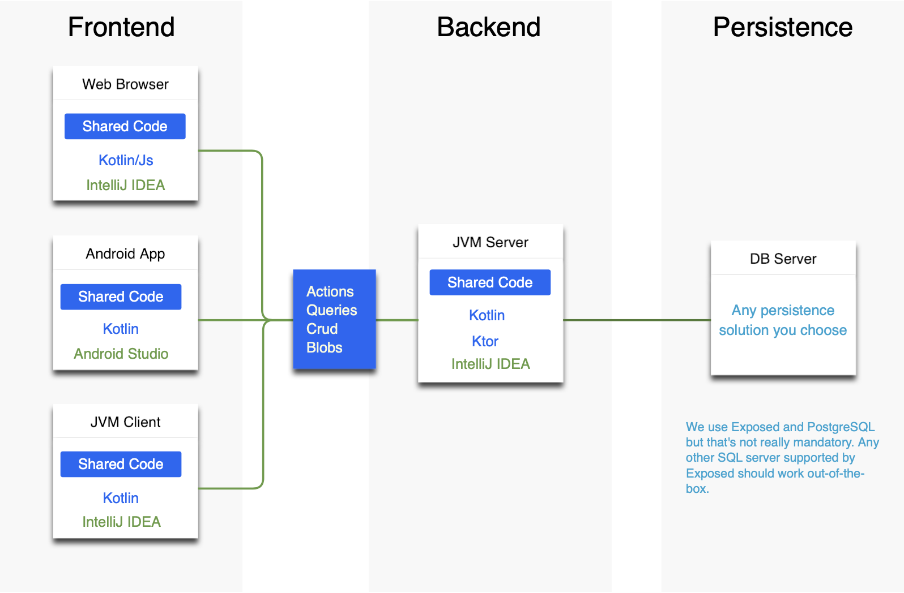

# Zakadabar

Full-stack development stack implemented as a Kotlin Multiplatform project.

Goal of the stack is to implement small business applications very fast without re-doing the same programming task again
and again.

Project status is **alpha testing**.

## Documentation

* [Accounts](doc/Accounts.md)

* [Demo - Backend and Web Frontend](demo/demo)
* [Demo - JVM client](demo/demo-jvm-client)

General structure of an application that uses the stack.



## Using

We release only Kotlin 1.4+ multiplatform packages.

Packages of Zakadabar Stack are available from GitHub Packages. To reference them from your project use the following
Gradle setup.

Property values are from your `<HOME-DIRECTORY>/.gradle/gradle.properties` file.
See [Authenticating to GitHub Packages](https://docs.github.com/en/packages/using-github-packages-with-your-projects-ecosystem/configuring-gradle-for-use-with-github-packages#authenticating-to-github-packages)
for more information.

```kotlin
repositories {
    mavenCentral()
    jcenter()
    maven {
        url = uri("https://maven.pkg.github.com/spxbhuhb/zakadabar-stack")
        metadataSources {
            gradleMetadata()
        }
        credentials {
            username = properties["github.user"].toString()
            password = properties["github.key"].toString()
        }
    }
}

val stackVersion = "2021.1.9"

commonMain {
  dependencies {
    api("hu.simplexion.zakadabar:core:$stackVersion")
  }
}
```

## Credits and Dependency Licenses

[Credits](doc/misc/credits.md) to the projects we built on.

## License

> Copyright (c) 2020 Simplexion Kft, Hungary and contributors
>
> Licensed under the Apache License, Version 2.0 (the "License");
> you may not use this file except in compliance with the License.
> You may obtain a copy of the License at
>
>    http://www.apache.org/licenses/LICENSE-2.0
>
> Unless required by applicable law or agreed to in writing, software
> distributed under the License is distributed on an "AS IS" BASIS,
> WITHOUT WARRANTIES OR CONDITIONS OF ANY KIND, either express or implied.
> See the License for the specific language governing permissions and
> limitations under the License.
