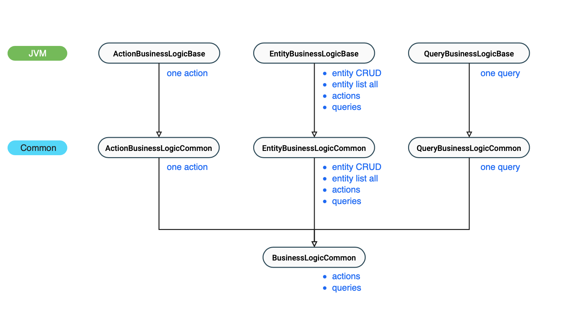

# Business Logic

Business logic (BL) components on the backend receive business objects and perform
the business level processing. It is important that BLs do not handle data 
persistence, they are pure implementation of business.

BLs extend [EntityBusinessLogicBase](/src/jvmMain/kotlin/zakadabar/stack/backend/business/EntityBusinessLogicBase.kt).
This class hides most of the implementation details like Ktor routing, serialization, data validation and so on.
It lets you concentrate on the business code you have to implement.

## Classes

This picture summarizes the class hierarchy of blocking business logic classes.
Blocking means that these classes use non-suspend functions.



## EntityBusinessLogicBase

EBLB (`EntityBusinessLogicBase`) provides many functions out-of-the-box:

- Ktor routing
- validation
- authorization
- audit log
- transaction
- serialization

All of these have sensible defaults, except authorization which you have to choose yourself.
The general pattern is that there is a variable in EBLB which contains the default, and you
can override it if you want. A very minimal example:

### Minimal EBLB

```kotlin
class SimpleExampleBlGen : EntityBusinessLogicBase<SimpleExampleBo>(
    boClass = SimpleExampleBo::class
) {

    override val pa = SimpleExampleExposedPaGen()

    override val authorizer = SimpleRoleAuthorizer<PrincipalBo> {
        all = StackRoles.securityOfficer
    }

}
```

This class provides all CRUD endpoints (list, read, create, update, delete) for the users
who have the security officer role.

`pa` is the [Persistence API](./PersistenceApi.md) (PA). It maps `SimpleExampleBo` business objects
into the SQL database. For simple CRUD you can use the generated PA, for more complex cases you
can extend it.

`authorizer` is an instance of [Authorizer](./Authorizer.md). Each business logic needs one, it 
performs authorization of incoming requests.

### Complex EBLB

```kotlin

class SimpleExampleBl : EntityBusinessLogicBase<SimpleExampleBo>(
    boClass = SimpleExampleBo::class
) {

    override val pa = SimpleExampleExposedPa()

    override val authorizer = SimpleRoleAuthorizer<SimpleExampleBo> {
        all = StackRoles.siteMember
        action(SimpleExampleAction::class, StackRoles.siteMember)
        query(SimpleExampleQuery::class, StackRoles.siteMember)
    }

    override val router = router {
        action(SimpleExampleAction::class, ::action)
        query(SimpleExampleQuery::class, ::query)
    }

    override val validator = object : Validator<SimpleExampleBo> {
        override fun validateCreate(executor: Executor, bo: SimpleExampleBo) {
            println("Incoming BO is ${if (bo.isValid) "valid" else "invalid"}.")
        }
    }

    override val auditor = auditor {
        includeData = false
    }

    private val roleBl by module<RoleBlProvider>()

    override fun create(executor: Executor, bo: SimpleExampleBo) : SimpleExampleBo {
        if (pa.count() >= 1000) throw BadRequestException("table limit reached")

        return pa.create(bo)
            .let {
                it.name = bo.name.lowercase()
                pa.update(it)
            }
    }

    override fun update(executor: Executor, bo: SimpleExampleBo) =
        pa.read(bo.id)
            .let {
                it.name = bo.name.lowercase()
                pa.update(it)
            }

    private fun action(executor: Executor, action: SimpleExampleAction): ActionStatusBo {
        println("Account ${executor.accountId} executed SimpleExampleAction")
        return ActionStatusBo(reason = "This is a successful test action invocation.")
    }

    private fun query(executor: Executor, query: SimpleExampleQuery) =
        pa.query(query)

}
```

`authorizer` - Here it has an action and a query added. When an account wants to perform this action, it
needs the site member role.

`router` - As this business logic provides an action, the routing for that specific action has to 
be added. This one binds the `PasswordChangeAction` BO to the `action` method of this class
with the `PasswordChangeAction` parameter. See [Routing](./Routing.md) and [URLs](../common/URLs.md) 
for more information.

`validator` - Each data modification request is validated by a validator before it is passed to the BL.
The default validator uses the `isValid` field of the BO. This field calls the standard validation
from `BoSchema`.

`auditor` - Auditors responsible for auditing system access. Here we configure the auditor
such a way that the request data is not included in the audit. In this case it is 
important, because this is the BL of PrincipalBo, and the requests may contain sensitive
information. See [Auditor](./Auditor.md) for more information.

`simpleExampleBl` - This is a reference to another EBLB. You can use the `module` function to
make a reference to another module, so you can call the functions it offers.

`update` - This is an override of the default CRUD update because we want some special
processing steps there.

`action` - This is an action the BL offers as an endpoint.

`query` - This is a query the BL offers as an endpoint.

## Standalone Action BL

Standalone Action BL is a module that supports only one action without an any links to
an entity. For example: an action that restarts the server.

To write a standalone action BL:

- extend [ActionBusinessLogicBase](/src/jvmMain/kotlin/zakadabar/stack/backend/business/ActionBusinessLogicBase.kt)
- set an authorizer
- implement the `execute` function

Note: `ActionBusinessLogicBase` is an extension of `EntityBusinessLogicBase<EmptyEntityBo>`. In this extension all
non-action functions throw `NotImplementedException`.

```kotlin
class SimpleStandaloneActionBl : ActionBusinessLogicBase<SimpleStandaloneAction, ActionStatusBo>(
    actionBoClass = SimpleStandaloneAction::class
) {

    override val authorizer = SimpleRoleAuthorizer<EmptyEntityBo> {
        action(SimpleStandaloneAction::class, StackRoles.siteMember)
    }

    override fun execute(executor: Executor, bo: SimpleStandaloneAction): ActionStatusBo {
        return ActionStatusBo(reason = "test action")
    }

}
```

## Standalone Query BL

Standalone Query BL is a module that supports only one query without an any links to
an entity. For example: a query that returns with a list of true random numbers 
generated by a hardware-based true random number generator.

To write a standalone query BL:

- extend [QueryBusinessLogicBase](/src/jvmMain/kotlin/zakadabar/stack/backend/business/QueryBusinessLogicBase.kt)
- set an authorizer
- implement the `execute` function

Note: `QueryBusinessLogicBase` is an extension of `EntityBusinessLogicBase<EmptyEntityBo>`. In this extension all
non-query functions throw `NotImplementedException`.

```kotlin
class SimpleStandaloneQueryBl : QueryBusinessLogicBase<SimpleStandaloneQuery, SimpleQueryResult>(
    queryBoClass = SimpleStandaloneQuery::class
) {

    override val authorizer = SimpleRoleAuthorizer<EmptyEntityBo> {
        query(SimpleStandaloneQuery::class, StackRoles.siteMember)
    }

    override fun execute(executor: Executor, bo: SimpleStandaloneQuery): List<SimpleQueryResult> {
        return emptyList()
    }

}
```

## Mechanism, Wrappers

The EBLB defines these business level functions.

| Wrapped | Non-Wrapped | Default Behaviour |
| --- | --- | --- |
| listWrapped | list | Executes `pa.list()`. |
| readWrapped | read | Executes `pa.read()`. |
| createWrapped | create |  Executes `pa.create()`. |
| updateWrapped | update |  Executes `pa.update()`. |
| deleteWrapped | delete |  Executes `pa.delate()`. |
| actionWrapped | action | Calls different functions based on action class. |
| queryWrapped | query |  Calls different functions based on action class. |

Wrapped version of the functions:

1. put everything in a transaction with `pa.withTransaction`
1. call `validator.validateXX`
1. call `authorizer.authorizeXX`
1. call the non-wrapped version
1. call `auditor.auditXX`
1. return with the result

When you call the non-wrapped version, none of the above is executed.

## Transactions

EBLB functions are wrapped in a transaction when:

- Ktor routing initiates the call
- you call the `wrapper` version of the function like: `createWrapper`

When you call the non-wrapper function like `create` you have to provide a
transaction.

## Find Other BLs

Use the `module` delegate to get a reference to another BL. This will create
a permanent reference to the BL instance with the given class. 

```kotlin
private val roleBl by module<RoleBlProvider>()
```

When there may be more than one instances of the given business logic interface or class,
pass a selector method to get the one you need. Note that here we are looking for 
a `RoleBlProvider`, not a `RoleBl`. With this pattern you can look up modules
by interface and select the one you need.

```kotlin
private val roleBl by module<RoleBlProvider> { it.namespace == "zkl-role" }
```

If you don't want to bind to the BL instance permanently use `first` or
`firstOrNull` methods of the server to find the BL you need.

```kotlin
server.firstOrNull<RoleBl>()?.getByName(StackRoles.securityOfficer)
```

## Router Provider

Companion object of EBLB has a `routerProvider` property. This is a function that is used to get a router
instance when the EBLB instance is created.

You can set this property to your own function, thus providing customized routers for all EBLBs. Please
note that you have to do this before the EBLB instances are created, so preferably in the `onConfigure`
method of the server.

## Auditor Provider

Companion object of EBLB has an `auditorProvider` property. This is a function that is used to get an
auditor instance when the EBLB instance is created.

You can set this property to your own function, thus providing customized auditors for all EBLBs. Please
note that you have to do this before the EBLB instances are created, so preferably in the `onConfigure`
method of the server.

## Cache Control

[KtorRouter](/src/jvmMain/kotlin/zakadabar/stack/backend/ktor/KtorRouter.kt) has an `apiCacheControl` function
which adds a `Cache-Control` header to responses created by `read`, `list`, `query` operations. 

* `apiCacheControl` calls `server.apiCacheControl` by default
* `server.apiCacheControl` sets the header to the value of `apiCacheControl` in the server settings
* default of `apiCacheControl` is `no-cache, no-store`

You can change cache control handling:

* globally, by setting the value in the configuration file
* globally, by extending [Server](/src/jvmMain/kotlin/zakadabar/stack/backend/Server.kt)
* for all EBLBs, by setting the `routerProvider` in EBLB.Companion
* locally, by using a router in the BL that extends KtorRouter and overrides `apiCacheControl`