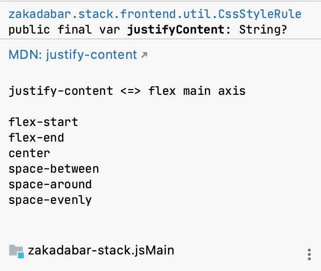
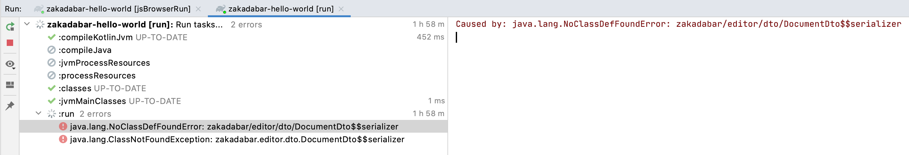

## General

### I can't find the CSS, HTML, JavaScript files, where are they?

In the Stack, there are none. For all those things we use Kotlin based solutions.

* JavaScript is obvious, the Kotlin compiler takes care of that.
* There is usually one, mostly constant, HTML file. For example
  see [index.html](../../../site/src/jsMain/resources/index.html) of the site.
* For theming and CSS we have our own implementation, please see [Css](/doc/guides/frontend/browser/Css.md) in the
  documentation.

## Tips and Tricks

### We Write Documentation

What's more, we try to write **helpful** documentation.

Check the in-line documentation when you want to find out some detail, keyword, function etc.

I - for example - tend to forget which one is "justify-content" and which one is "align-items".

So, when you hover over "justifyContent" you'll see something like this:



### ZkElement addKClass

If you set addKClass in [ZkElement](/src/jsMain/kotlin/zakadabar/stack/frontend/builtin/ZkElement.kt) to `true` you will
see the Kotlin class of your elements in the browser inspector.

Best place to add this setting is the application bootstrap.

```kotlin
ZkElement.addKClass = true
```


### Trace Ktor Routing

To trace Ktor routing set `tracerouting`
in [zakadabar.stack.server.yaml](../../../site/template/app/etc/zakadabar.stack.server.yaml) to true:

```yaml
traceRouting: true
```

### IntelliJ IDEA

* Use Double-Shift to find files fast.
* Use Command-B or Ctrl-B often. As we use Kotlin for everything it works very well.
* Use "Mark as Excluded" and "Show Excluded Files" to hide the boilerplate.

### Running the Webpack devServer in Continuous Mode

* Use the "jsBrowserRun" manually first.
* This will add a run configuration.
* Edit the run configuration and add "--continuous" to "Arguments".

### Focus on Inputs

If you try to focus on a form input field automatically, and it does not work put the focus code into an animation frame
like this:

```kotlin
window.requestAnimationFrame {
  dto::accountName.find().focus()
}
```

## Errors

### Backend Throws NoClassDefFoundError

This is mostly because the compiler replaced the .jar file under the JVM, and it did not realize what's happening.

Restart the backend.



### Exposed

#### No Transaction in Context

`Caused by: java.lang.IllegalStateException: No transaction in context.`

Means you forgot to add the transaction block for Exposed:

```kotlin
fun query(executor: Executor, query: ExampleQuery) {
    // this throws the exception
}
```

vs.

```kotlin
fun query(executor: Executor, query: ExampleQuery) = transaction {
  // this works
}
```

#### Loading from Left Join

When loading from a left join and there is no record to join with you may get an exception like this:

```text
java.lang.NullPointerException: Parameter specified as non-null is null: method zakadabar.discussions.dto.PostDto.<init>, parameter relations
	at zakadabar.discussions.dto.PostDto.<init>(PostDto.kt)
```

The solution is use this syntax:

```kotlin
TopicDto(
  relations = (it[RelationTable.relation] as String?) ?: ""
)
```

#### Cannot Import Exposed eq

No idea why this happens, Just add the import manually:

```import org.jetbrains.exposed.sql.SqlExpressionBuilder.eq```

### NPM + Yarn lock - whatever wherever ...

```text
* What went wrong:
  Execution failed for task ':kotlinNpmInstall'.
>                 Process 'Resolving NPM dependencies using yarn' returns 1
> 
```

* Gradle Clean

### kotlinx.serializer stuff cannot be imported after Gradle clean

This happens if you commit with "organize imports" on. Add an `import kotlinx.serialization.*` to the files in error.