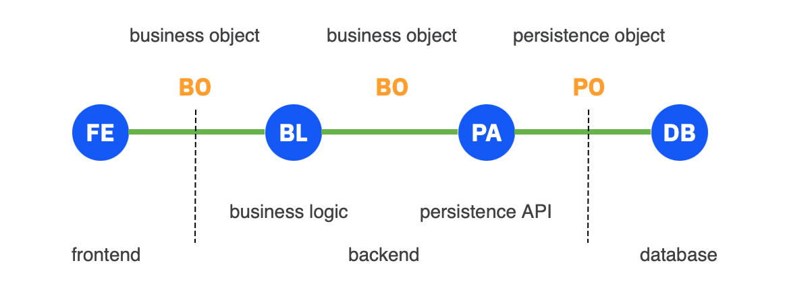
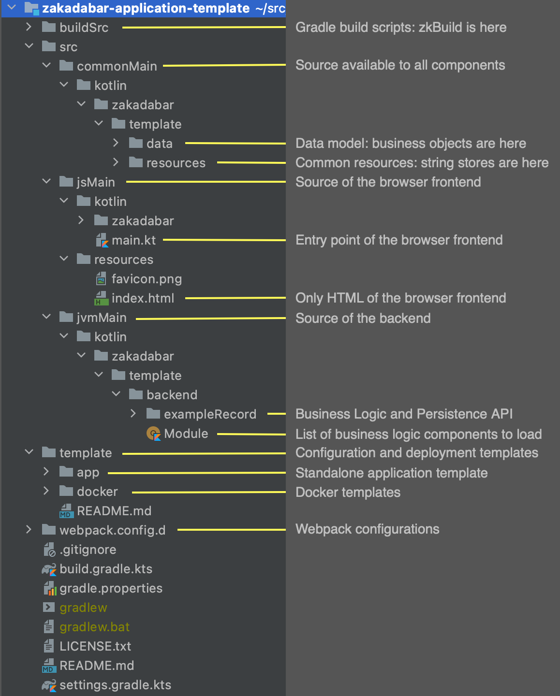

# Introduction: Software Model

Zakadabar applications start from the data model. This is a very important point. When the data
model is well-defined, applications almost build up themselves.

There are a few terms we use, this picture summarizes them and their relationships.



**BO** - Business Objects store the data the application handles. They are the focal points
of Zakadabar, because they define the data model. You can automatically generate frontend
components, persistence APIs, routing from this data model. BOs do not contain processing
code, that is in the business logic components.

**FE** - Frontends can be web browsers, Android devices or plain JVM clients.

**BL** - Business logic components on the backend receive business objects and do
the business level processing. It is important that business logic components do 
not handle data persistence, they are pure implementation of business processing.

**PA** - Persistence APIs are responsible for business object persistence. They do
not perform any modification on the business data, they simply put it somewhere,
so business logic components can get it later.

The general operating mechanism of the application is that:

1. the frontend sends a business object to the business logic, then
1. the business logic process the business object, and
    1. sends business objects (not necessary the same as received) to the persistence API,
    1. sends a response business object to the frontend.

## Frontend

Frontends may be web browsers, Android applications or JVM clients.

### Android And JVM Frontends

For Android and simple JVM we use the UI provided by the environment. The stack
provides the data model, the communication and the data validation. 
  
This may improve in the future, but for now the mobile UI is not in focus.

### Browser Frontend

For browsers the stack uses its own UI components. This means that it is not built on
a framework (React, Bootstrap etc). If you wonder why, check the browser frontend
documentation. You will see that the level of integration the stack provides for
the UI is extreme.

## Backend

The backend have three main areas:

* Ktor as web server, handles the incoming request,
* business logic components,
* persistence API components.

### Business Logic

When a request is received from the frontend, Ktor and the stack processes it
until a business object is ready for business level processing.

Your business logic module gets a complete, validated instance for processing, so
you can concentrate on the actual functionality you have to implement.

During processing, you'll probably want to interact with the persistence API which
is able to persist your business objects and retrieve them from the database when
needed. Business logic components don't worry about the persistence.

### Persistence API

Persistence API components map between business objects and a database. 

The default components use Exposed, JDBC and SQL, but you can replace them with
something else, for example to store data in a non-SQL database.

These PAs do not perform any business level data processing. They are solely
responsible for putting the data into the database and getting it back later.

## Business Objects

Business Objects store the data the application handles. A user account is
a BO, a shopping cart item is a BO, a binary data array (an image for example)
is a BO. All data that is related to the business is stored in a BO. 
 
Business Objects have a few stereotypes:

* basic - nothing special, just some data
* entity - a business entity, it always has an id
* query - parameterized request of data
* action - an atomic action to be executed by the business logic
* blob - a binary business object, usually paired with some meta-data

The stack is about handling business objects as safe and as comfortable as possible.

For example, you can create a new shopping cart item like this from all frontends:

```kotlin
CartItem(selectedProduct.id, quantity = 1).create()
```

As the result of the line above, the `create` method of your business logic module 
is called on the backend:

```kotlin
override fun create(executor : Executor, bo : CartItem) {
    // what your backend does with a cart item
}
```

You don't have to worry about what's between, the stack handles all that.

The stack provides automatic binding and building functions for BOs. Our goal
is that you can just define a BO and have everything work (FE + BE) automatically.

## Source Code Structure

This picture summarizes the source code structure of a Zakadabar project.

