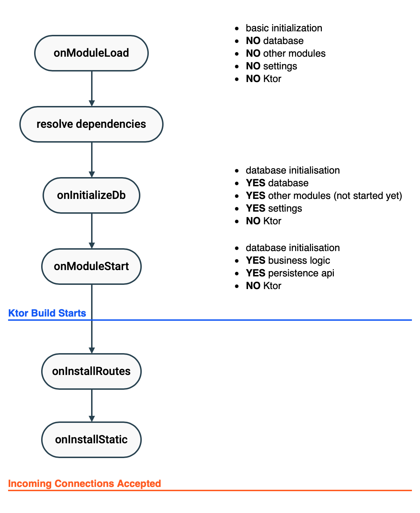

# Backend Modules

Backend modules are the building blocks of the server. When you decide the functions
your application provides, you make a list the modules you need for those functions.

Once you have the list, you can set up your application by:

- adding the modules programmatically, and/or
- adding the modules from the configuration.

## Add From Configuration

Add the module to the configuration file (etc/zakadabar.stack.server.yaml) as
the example below shows.

```
modules:
  - zakadabar.site.backend.Module
  - zakadabar.site.backend.Module2
```

## Add Programmatically

To add modules programmatically, use the `server` global variable and simply
add the modules like this.

```kotlin
server += SimpleExampleBl()
```

## Write Module Bundles

To pack a number of modules together, so all of them can be installed at once,
create a module bundle. This is basically a simple module that adds other
modules during server startup. 

To write a module bundle:

- Create an object that implements the interface [BackendModule](/src/jvmMain/kotlin/zakadabar/stack/backend/BackendModule.kt).
- Use the `onModuleLoad` function to add modules to the server.

```kotlin
@PublicApi
object Module : BackendModule {
    
    override fun onModuleLoad() {
        server += SessionBackend
        server += AccountBackend
        server += RoleBackend
        server += RoleGrantBackend

        server += ShipBackend
        server += SpeedBackend
    }
    
}
```

## Module Lifecycle

This picture summarizes the module startup sequence.



### onModuleLoad

Perform only basic initialization in `onModuleLoad`.

### onInitializeDb

First time DB initialization and DB upgrades (if necessary).

### onModuleStart

Called after:

- all modules are loaded with `onModuleLoad` executed
- all module references are resolved
- the database is initialized, `onInitializeDb` executed for all modules
- settings are available

### onInstallRoutes

This function is called to add the routes to Ktor. Most backends delegate setting
the routes to their `router`. See [Routing](./Routing.md) for more information.

### onInstallStatic

This function is called when adding static resources to Ktor. It provides an
easy way to register directories for static service. Check
[ContentBackend](/src/jvmMain/kotlin/zakadabar/stack/backend/custom/ContentBackend.kt)
for an example.

