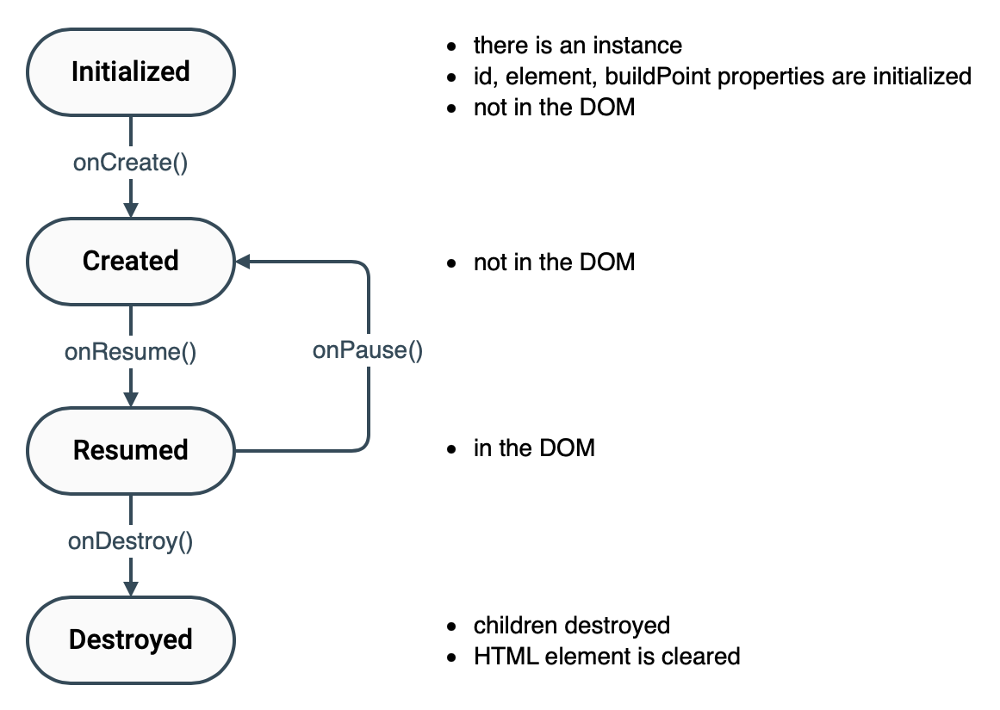

# Elements

The browser UI heavily uses the [ZkElement](/src/jsMain/kotlin/zakadabar/stack/frontend/builtin/ZkElement.kt) class.
Almost all built-in components extend `ZkElement` because it provides convenient builtin functions.

ZkElement properties

| Property | Description |
| --- | --- |
| id  | ID of the ZkElement. All ZkElements have a unique, auto-generated id. |
| element | The HTML DOM node that belongs to this ZkElement.<br>The `id` of this DOM node is "zk-$id" where `id` is the value of the `id` property. |
| lifeCycleState | [ZkElementState](/src/jsMain/kotlin/zakadabar/stack/frontend/builtin/ZkElementState.kt) state of the ZkElement.<br>Used to prevent un-intentional reuse of elements and to manage element swapping. |
| childElements | ZkElements that are child of this one. Child management functions are there to add / remove children easily. |
| buildElement | The HTML DOM element that is currently built. This may change a lot during the build process as DIVs are usually added to build a visual layout. |

## Lifecycle

ZkElement has a simple lifecycle:



We typically use `onCreate` to build the content of the element and use `onResume` to apply the current state when going
on-scren.

<div data-zk-enrich="Note" data-zk-flavour="Info" data-zk-title="Lifecycle Management">
ZkElement builder methods manage the lifecycle of children elements automatically. When you add an
element to another the lifecycles are synchronized.
</div>

<div data-zk-enrich="Note" data-zk-flavour="Warning" data-zk-title="onDestroy">
onDestroy is called only when you directly call ZkElement.clear,
ZkElement.clearChildren or ZkElement.onDestroy. It is not an all-purpose destructor.
This behaviour is intentional.
</div>

## Build Structures

It is very common, that a frontend element has an internal layout with a lot of `div`s, other elements, etc. To support
this [ZkElement](/src/jsMain/kotlin/zakadabar/stack/frontend/builtin/ZkElement.kt)
provides a number of builder methods.

### Operators [source code](../../../../lib/examples/src/jsMain/kotlin/zakadabar/lib/examples/frontend/button/ButtonExamples.kt)

Operator overloads are provided to build structures idiomatically.

| Operator | Works On | Description |
| --- | --- | --- |
| `+` | String | Add text safely at the current build point, no need for escape. |
| `!` | String | Add text unsafely at the current build point, sets innerHTML, **must** be properly escaped. |
| `+` | HTMLElement | Adds an HTML element at the current building point. |
| `+` | ZkElement? | Adds a ZkElement at the current building point. |
| `+` | List&lt;ZkElement&gt; | Adds all ZkElements in the list at the current building point. |
| `+=` | ZkElement, ZkElement? | Adds the ZkElement to another. |
| `-=` | ZkElement | Removes a ZkElement from another.<br>Removes from `childElements` and from the DOM.<br>Pauses the child. |
| `-=` | KClass&lt;*&gt; | Removes all children that are instances of the given class. |

```kotlin
class OperatorExample(
    element: HTMLElement
) : ZkElement(element) {

    val container = ZkElement()

    override fun onCreate() {
        super.onCreate()

        + div(zkLayoutStyles.block) {
            + "text1"
            ! """<span style="font-size: 150%">text2</span>"""
            + (document.createElement("input") as HTMLElement) marginBottom 20

            + container

            container += buttonPrimary("A Button, click to hide the note") {
                container -= ZkNote::class
            } marginBottom 20

            container += notePrimary("A Note", "This note will disappear shortly.")
        }
    }
}
```

The example above results in this:

<div data-zk-enrich="OperatorExample"></div>

## TODO

When you add Com plexElement instances they will be children of the ComplexElement that performs the building. The DOM
and the ComplexElement structure will be different in this case, so if you want to swap elements dynamically you have to
use a wrapper:

```kotlin
class DeepInTheForest : ComplexElement() {

    override fun init(): ComplexElement {

        val sometimesThis = SimpleText(" is this the shortest route")
        val sometimesThat = SimpleText(" are we lost")

        val wrapper = ComplexElement()

        build {
            + div {
                + row {
                    ! "we are deep in the forest ...&nbsp;"
                    + wrapper
                    + " ?"
                }
            }
        }

        var round = 0

        launch {
            while (true) {
                delay(2000)
                wrapper -= SimpleText::class
                wrapper += if (round % 2 == 0) sometimesThat else sometimesThis
                round ++
            }
        }

        return this
    }
}
```

## Data load

### More than one fetch during init

To fetch more than one data set during the initialization of a ComplexElement use `coroutineScope`.

Remember that the order in which the internal launch blocks run **is random**.

It **is guaranteed** that all internal launch blocks finish before anything after
`coroutineScope` is executed.

This my have an effect on data fields and on the elements of the UI. For example:
`insertFirst` and `insertBefore` has to be correct, or the UI will be confused.

```kotlin
class ParallelDownloadView(private val stuffId: Long) : ComplexElement() {

    private val childNames = ComplexElement()
    private val statistics = ComplexElement()

    private lateinit var stuff: StuffDto
    private lateinit var children: List<StuffDto>

    override fun init(): SimpleElement {

        val loading = StaticText(t("loading"))

        this += loading // add loading, use variable so we can easily remove it later

        launch {     // launch the block in the global scope   

            coroutineScope {    // will wait until all coroutines in the local scope finish
                this.launch {   // launch this block in the local scope (it is local because of "this.")
                    stuff = StuffDto.comm.get(stuffId) // download the data from the server
                    insertFirst(StaticText(stuff.name)) // you can create elements on the fly if you don't want to access them easily later
                }
                this.launch {   // launch this block in the local scope (it is local because of "this.")
                    children = StuffDto.comm.getChildren(stuffId) // download the children of stuff
                    childNames += children.map { StaticText(it.name) } // add a StaticText for each children with the name as content
                    insertBefore(children, loading) // insert the children before loading
                }
            }

            this -= loading // remove loading, we have all the data, no need for it any more

            statistics.innerHTML =
                "#${stuffDto.id}: ${stuffDto.size} bytes, ${children.size} children" // set statistics
            this += statistics // show it to the user
        }

        return super.init()
    }

}
```