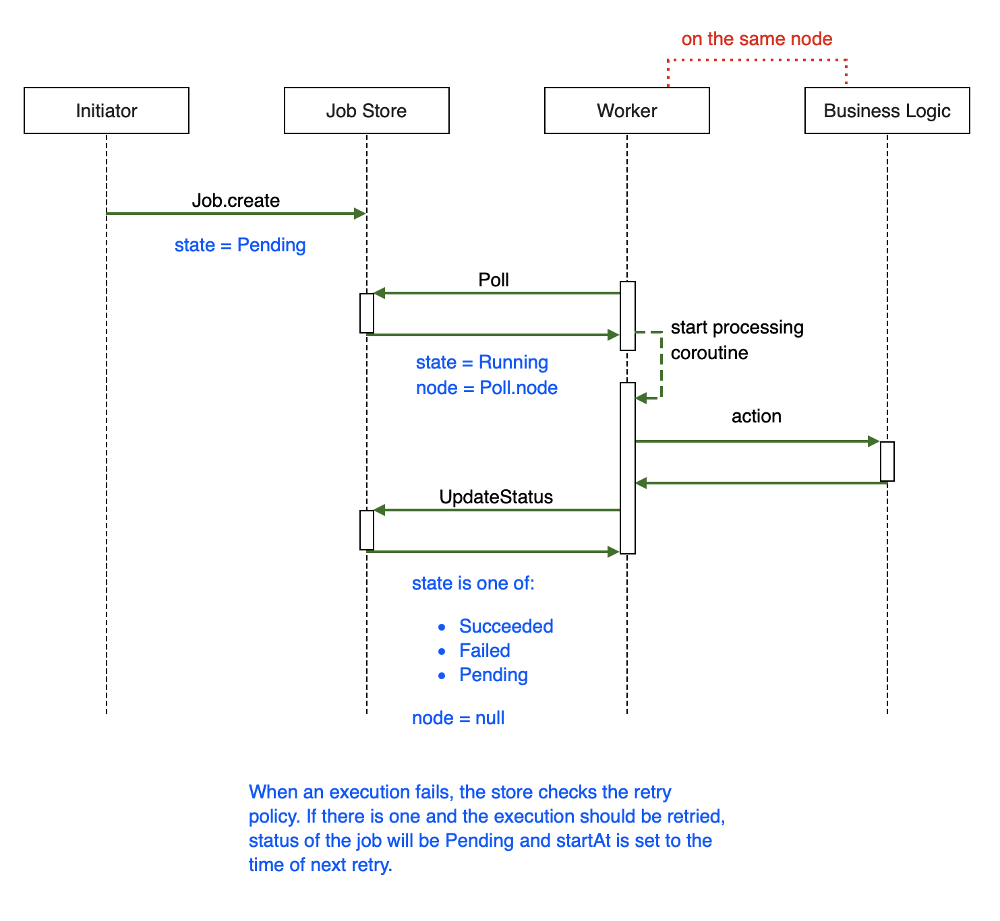

# Plug and Play: Schedule

Schedules and executes jobs in single-node or multi-node environment.

## Terminology

### Job

A [Job](../../../../../exp/schedule/src/commonMain/kotlin/zakadabar/lib/schedule/model/Job.kt) is a managed action execution:

- starts at a given time (or after)
- may be retried automatically after a failure (if retry policy allows)
- can be dispatched to other nodes

This picture summarizes the life of a job:



### Job Store

The job store is a backend component that provides:

- job persistence
- job queuing
- retry policy handling

The default job store uses SQL to store the jobs.

### Worker

A module that polls jobs from the store and executes them. Workers run
on the same node as the business logic that actually executes the job.

## Setup

**common**

1. add the gradle dependency

**backend**

1. add the module to your server configuration, for details see [Modules](../../backend/Modules.md)
1. configure settings, for more information, for details see [Settings](../../backend/Settings.md)

**frontend**

1. add the service to your application, see [Introduction: Browser](../../browser/Introduction.md)
1. add the routing to your frontend, for details see [Routing](../../browser/structure/Routing.md)
1. add the navigation to your side to open the pages, see [SideBar](../../browser/builtin/SideBar.md)

### Common

#### gradle

```kotlin
implementation("hu.simplexion.zakadabar:schedule:$stackVersion")
```

### Backend

#### add module

```kotlin
zakadabar.lib.schedule.backend.install()
```

#### configure settings

For customized settings create a 'lib.schedule.yaml' file in your settings directory,
check [ModuleSettings](../../../../../lib/accounts/src/commonMain/kotlin/zakadabar/lib/schedule/data/ModuleSettings.kt)
for description of parameters.

```yaml
```

### Frontend

#### application

```kotlin
zakadabar.lib.schedule.frontend.install(application)
```

#### routing

```kotlin
zakadabar.lib.schedule.frontend.install(this)
```

#### navigation (for sidebar)

```kotlin
withRole(appRoles.securityOfficer) {
    + item<Schedules>()
    + item<Jobs>()
}
```

## Database

The module uses SQL for data persistence. At first run it creates these SQL objects automatically.

| Table | Content |
| --- | --- |
| `job` | Jobs. |
