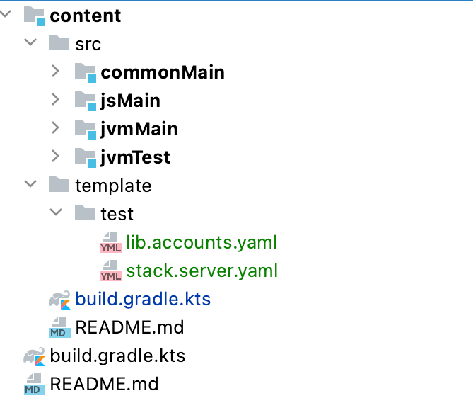

# Backend Testing

## API testing

The following setup lets you test API with:

- actual Ktor engine,
- H2 database,
- JVM client.

To create the environment for your tests:

1. add configuration files
1. add a test server setup
1. add a companion to your test class

### Configuration Files

The following picture shows how to add the configuration files for your tests.



**lib.accounts.yaml** 

- Password of "so" account is "so".

```yaml
initialSoPassword: so
```

**stack.server.yaml**

- H2 in-memory database.
- Ktor runs on 8888.

```yaml
database:
  driverClassName: org.h2.Driver
  jdbcUrl: "jdbc:h2:mem:"
# Use this to save the DB for inspection. Remember to delete it before runs!
#  jdbcUrl: "jdbc:h2:./app/var/db"
  username: test
  password: Almafa.12

traceRouting: false
staticResources: ./var/static

ktor:
  port: 8888
```

### Test Server Setup

Create a file that sets up your test server. The example below:

- creates a server with the configuration above
- adds `lib:accounts`, so can test with full authorization,
- adds `lib:i18n`, so we can test with translation,
- starts Ktor  
- automatically logs in if a username and password is provided
- gets the session, so we can use it in our test code

```kotlin
import kotlinx.coroutines.runBlocking
import zakadabar.lib.accounts.data.LoginAction
import zakadabar.lib.accounts.data.SessionBo
import zakadabar.stack.StackRoles
import zakadabar.stack.backend.BackendModule
import zakadabar.stack.backend.Server
import zakadabar.stack.backend.authorize.Authorizer
import zakadabar.stack.backend.authorize.AuthorizerProvider
import zakadabar.stack.backend.authorize.SimpleRoleAuthorizerProvider
import zakadabar.stack.backend.authorize.UnsafeAuthorizer
import zakadabar.stack.backend.business.EntityBusinessLogicBase
import zakadabar.stack.backend.server
import zakadabar.stack.data.CommBase
import zakadabar.stack.data.builtin.misc.Secret
import zakadabar.stack.data.entity.EntityBo
import zakadabar.stack.data.entity.EntityId

open class TestCompanion {

    open fun setup(username : String?, password : String?) {
        server = Server("test")
        server += TestModule
        server.main(arrayOf("--test", "--settings", "./template/test/stack.server.yaml"))

        CommBase.baseUrl = "http://127.0.0.1:8888"

        if (username != null && password != null) {
            runBlocking {
                LoginAction(username, Secret(password)).execute()
                ContentBlTest.session = SessionBo.read(EntityId("current"))
            }
        }
    }

    open fun teardown() {
        server.ktorServer.stop(1000, 10000)
    }

}

object TestModule : BackendModule {

    override fun onModuleLoad() {
        zakadabar.lib.accounts.backend.install()
        zakadabar.lib.i18n.backend.install()

        server += SimpleRoleAuthorizerProvider {
            all = StackRoles.siteMember
        }

        install() // this is the module we test
    }

}
```

### Test Class Companion

This companion:

- creates the test Ktor Server with a test H2 instance
- sets `CommBase.baseUrl` to the created Ktor instance
- performs a login as "so" and gets the session

In the tests you can work just as you would do in a frontend module.

```kotlin
class ContentBlTest {

    companion object : TestCompanion() {

        lateinit var session: SessionBo

        @BeforeClass
        @JvmStatic
        fun setup() = super.setup("so", "so")

        @AfterClass
        @JvmStatic
        override fun teardown() = super.teardown()

    }
    
    @Test
    fun testByLocalizedPath() = runBlocking {

        val localeHu = default<LocaleBo> {
            name = "hu"
            status = LocaleStatus.Public
        }.create()
        
        // ... more test code follows ...
    }
    
}
```
