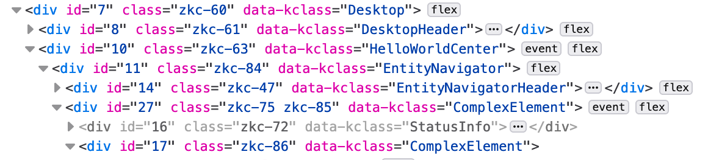

## General

### Where are the CSS, HTML, JavaScript files?

In the Stack, there are none. For all those things we use Kotlin based solutions.

* JavaScript is obvious, the Kotlin compiler takes care of that.
* There is usually one, mostly constant, HTML file. For example
  see [index.html](../../../site/src/jsMain/resources/index.html) of the site.
* For theming and CSS we have our own implementation, please see [Themes, Css](/doc/guides/browser/structure/ThemesCss.md) in the
  documentation.
  
### Spring, JPA, etc?

Actually, nothing prevents you from using those. We haven't tried, but it
should work. Spring endpoints might be a bit tricky because of the routing,
I wouldn't go into that and stick to Ktor. Apart that I don't see any real
problems. I might be wrong though.

We wanted to be independent of JVM as much as possible. While the backend code is
in `jvmMain` at the moment, it is structured such a way that we could move it
to `commonMain` with reasonable effort. This would open the possibility to
run the backend in Node.js for example.

### React, Bootstrap, jquery, etc?

Yet again, feel free to use them. Technically you can ignore all the built-in
components and use only the communication part of the stack. Or ignore the
communication and use only the UI components. Your choice.

We do not plan to use any of those in the stack, there are a few reasons for that.
First, we wanted to be independent (yet again) from any big JavaScript libraries 
and the way of thinking they enforce.

The second reason is that because of this independence we can take advantage
many Kotlin features and integrate our components tightly together. This would
be much harder if we would try to bind existing libraries together.

Third, we wanted a really consistent look and feel. This way we don't have to
worry about styling other libraries. Everything in the core uses the same 
style and theme system, and we try to stick to it as much as possible in libs.

It is not realistic to stay away from npm dependencies everywhere, for example
`lib:markdown` uses `highlight.js` because we really did not want to do that
by ourselves. When we add a chart library, it will most probably use an NPM
dependency.

### Not Semantic Versioning?

There are many reasons, for some of them, please read this article without any bias: 
[Semver Will Not Save You](https://hynek.me/articles/semver-will-not-save-you/).

## Errors

### Gradle Is Stuck

This may happen when you try to start the backend and the frontend from IDEA. On some machines it happens, on some
others it doesn't. We have no IDEA (pun intended) why this is happening.

Open the `Terminal` of your IDEA (or a normal terminal of your operating system) and use `./gradlew run` from the project
directory. This will start the backend in the terminal and you'll be able to start the frontend from IDEA (or from
another terminal.)

### Backend Throws NoClassDefFoundError

This is mostly because the compiler replaced the .jar file under the JVM, and it did not realize what's happening.

Restart the backend.


### Exposed

#### No Transaction in Context

`Caused by: java.lang.IllegalStateException: No transaction in context.`

Means you forgot to add the transaction block for Exposed:

```kotlin
fun query(executor: Executor, query: ExampleQuery) {
    // this throws the exception
}
```

vs.

```kotlin
fun query(executor: Executor, query: ExampleQuery) = transaction {
  // this works
}
```

#### Loading from Left Join

When loading from a left join and there is no record to join with you may get an exception like this:

```text
java.lang.NullPointerException: Parameter specified as non-null is null: method zakadabar.discussions.dto.PostDto.<init>, parameter relations
	at zakadabar.discussions.dto.PostDto.<init>(PostDto.kt)
```

The solution is use this syntax:

```kotlin
TopicDto(
  relations = (it[RelationTable.relation] as String?) ?: ""
)
```

#### Cannot Import Exposed eq

No idea why this happens, Just add the import manually:

```import org.jetbrains.exposed.sql.SqlExpressionBuilder.eq```

### NPM + Yarn lock - whatever wherever ...

```text
* What went wrong:
  Execution failed for task ':kotlinNpmInstall'.
>                 Process 'Resolving NPM dependencies using yarn' returns 1
> 
```

* Gradle Clean

### kotlinx.serializer stuff cannot be imported after Gradle clean

This happens if you commit with "organize imports" on. Add an `import kotlinx.serialization.*` to the files in error.

## Tips and Tricks

### ZkElement addKClass

If you set addKClass in [ZkElement](/src/jsMain/kotlin/zakadabar/stack/frontend/builtin/ZkElement.kt) to `true` you will
see the Kotlin class of your elements in the browser inspector.

Best place to add this setting is the application bootstrap.

```kotlin
ZkElement.addKClass = true
```



### Debug SQLs (Exposed)

Set `db.debugSql` in [stack.server.yaml](../../../site/template/app/etc/stack.server.yaml) to true:

```yaml
db:
   # other stuff...
   debugSql: true
```

### Trace Ktor Routing

Set `tracerouting` in [stack.server.yaml](../../../site/template/app/etc/stack.server.yaml) to true:

```yaml
traceRouting: true
```

### IntelliJ IDEA

* Use Double-Shift to find files fast.
* Use Command-B or Ctrl-B often. As we use Kotlin for everything it works very well.
* Use "Mark as Excluded" and "Show Excluded Files" to hide the boilerplate.

### Running the Webpack devServer in Continuous Mode

* Use the "jsBrowserRun" manually first.
* This will add a run configuration.
* Edit the run configuration and add "--continuous" to "Arguments".

### Focus on Inputs

If you try to focus on a form input field automatically, and it does not work put the focus code into an animation frame
like this:

```kotlin
window.requestAnimationFrame {
  dto::accountName.find().focus()
}
```