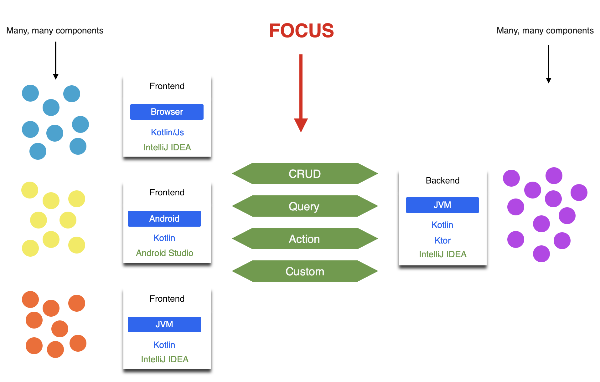

# Welcome

Zakadabar Stack is a Kotlin software library for full-stack application development.

Check the <a href="/ShowCase">Show Case</a> or the <a href="https://marina.zakadabar.com" target="_blank">Marina Demo</a> to see sites implemented with the
stack.

Actually, this documentation site is also built with the stack.

 

Project status of the stack is <b>alpha</b>. This means that some migration steps may be needed
between releases. See <a href="https://kotlinlang.org/docs/reference/evolution/components-stability.html" target="_blank">components stability</a>.

Building full-stack, deployable applications is inherently complex. It is quite a task in itself just to collect the
areas one has to pay attention to.

The stack aims to provide at least one solution for each requirement a full-stack application has to meet. Check the
list of features below to get an idea what's included.

Our ultimate goals:

* maximize developer output,
* minimize developer frustration,
* deliver prototypes and quality products very fast.

## Highlights

* Use Kotlin whenever possible (that is: close to 100%).
* Use shared code for data models and schemas.
* When something can be done automatically, do it automatically.
* Figure sensible defaults and use them whenever possible.
* Secure by default: deny-first, allow explicitly.
* Minimize dependencies.
* Make administration and operation of the products easy.

## The Main Concept

The stack focuses on the communication data model. This data model:

* defines how our components talk with each other,
* is the actual API our backend provides and our frontends consume,
* contains a schema to support data validation,
* automatically provides:
  * frontend communication components,
  * type-safe backend routing,
  * frontend forms, tables.

## Features - Common

| Feature | Details |
| --------| ------- | 
| Accounts | Public and private account API and persistence. Separated principal API for authentication and authorization. |
| Authentication | Default is password based. Integration with KeyCloak planned. |
| Authorization | Role based. |
| Session Handling | Ktor sessions with SQL backend. |
| Data Model | Clients and servers share data model code. Data model generates communication modules automatically. |
| Data Serialization | Kotlinx.serialization | 
| Data Transfer | Automatically handled by on-demand created `comm` instances. Built-in binary data handling. |
| Data Validation | Clients and servers share schema code. Automatic browser form validation with schema. |

## Features - Browser

| Feature | Details |
| --------| ------- | 
| Admin pages | Built-in pages for administration tasks, integrated with built-in backends. |
| Builders | Intuitive UI builders. Adding and subtracting elements. HTML is mostly hidden. |
| Colors | Color palettes: Zakadabar, Material. |
| Components | Ready-to use UI components. |
| Components I18N | Automatic. |
| Components Lifecycle | Automatic. |
| Components Theming | Automatic, consistent look and feel. |
| Communication | One-liners for CRUD, BLOB, queries and actions. Based on the shared data model. |
| CSS | Extendable, dynamically changeable, Kotlin based CSS definitions. |
| Dock | Docking feature (like in gmail).
| Form | Best form framework ever. :D |
| Form Builder | Build forms just by listing the data model fields. |
| Form Fields | Field components for common data types. (Date and time is missing tho, that hurts.) |
| Form Layouts | Pre-defined form layouts for most use cases. |
| Form Labels | Automatic label addition and i18n. |
| Form Marks | Automatic mandatory marks based on the data model. |
| Form Validation | Automatic validation and customer feedback. |
| Form Submit | CRUD out of the box, customisable, automatic validation and feedback before submit. |
| I18N | Automatic. Translations stored on backend, may be changed and extended during runtime. |
| Icons | SVG based, from Material. |
| Images | Image upload and view support. |
| Layout | Multi-layout system, automatic layout switch by content. Sensible default layout. |
| Modals | General modal support. Confirmation modal dialog. |
| Responsive Design | Built-in components are responsive by default. (Not finished yet!)| 
| Routing | Built in URL to page resolution based on the routing table. |
| Table | Virtualized table based on CSS grid, up to 100.000 rows. |
| Table Builder | Build tables just by listing the data model fields. |
| Table Columns | Column components for common data types. Resizable.  |
| Table Sort | Data type aware sorting. |
| Table Search | Data type aware search. |
| Table Export | Data type aware CSV export. |
| Themes | Built-in light, dark and contrast themes. Easy to extend. Persistence handling. |
| Title Bar | Tables, Forms, Pages are title bar aware and automatically update title, actions. |
| Toast | Built-in toasts for info, warning, error, success. |

## Features - Android

| Feature | Details |
| --------| ------- | 
| Communication | One-liners for CRUD, BLOB, queries and actions. Based on the shared data model. |

## Features - Backend

| Feature | Details |
| --------| ------- |
| Authentication | Username and password based authentication. Automatic lock after try limit. |
| Authorization | One-liner authorization checks (role based). |
| Builtin Backends | Built-in backends for common backend data (accounts, roles, translations, etc.) |
| Persistence | SQL, default uses Exposed. |
| Routing | Uses Ktor routing. Pre-defined helpers for easy and types safe backend setup. |
| Sessions | Built-in session handling fully integrated with the client. Session expiration. Session renewal. |