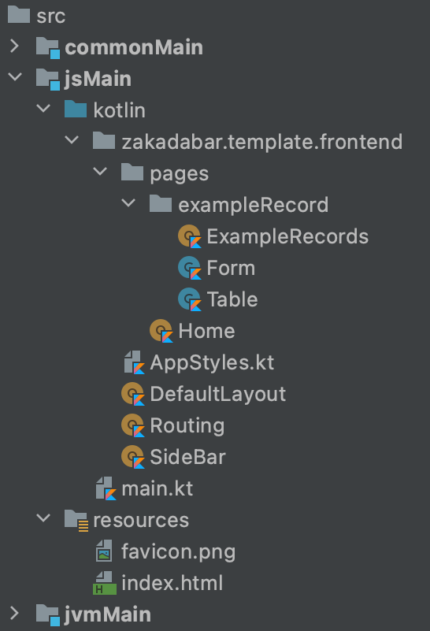

# Introduction: Browser Frontend

Browser frontends built with the stack are single page applications. The Kotlin compiler produces a single `.js` file
and there is one `index.html` which references that js file.

The source code compiled into the `.js` file is in the `jsMain` source set. The picture below shows the usual structure
of jsMain in a Zakadabar project. The names are quite self-explanatory, read on for the details.



## Startup: index.html

[index.html](/site/src/jsMain/resources/index.html)

* is usually the only HTML file we use,
* served whenever the server encounters an unknown URL,
* contains minimal content,
* is rarely modified manually,
* is modified by the build process to replace `site.js` with `site-${project.version}.js`.

The most important point in `index.html` is that calls the `main` function
in [main.kt](/site/src/jsMain/kotlin/main.kt)

```html
<!doctype html>
<html lang="hu">
<head>
    <meta charset="UTF-8">
    <meta name="viewport" content="width=device-width, initial-scale=1, maximum-scale=1">
    <title>Zakadabar</title>
    <link rel="shortcut icon" type="image/jpeg" href="/favicon.png">
    <link rel="preconnect" href="https://fonts.gstatic.com">
    <link href="https://fonts.googleapis.com/css2?family=IBM+Plex+Sans:wght@300;400;500&display=swap" rel="stylesheet">
</head>
<body>
</body>
<script src="/site.js"></script>
</html>
```

<div data-zk-enrich="Note" data-zk-flavour="Secondary" data-zk-title="Search Engine Optimization">
Google crawler executes the JavaScript on the site then checks the content of the site to index.
Check <a href="https://developers.google.com/search/docs/guides/javascript-seo-basics">Understand the JavaScript SEO basics</a>
for more information about the topic.
</div>

## Startup: main.kt

The `main` function in [main.kt](/site/src/jsMain/kotlin/main.kt) is the entry point of the application.

As first step, it creates the application instance and stores it in the `application` variable which is defined
in [ZkApplication.kt](/core/core/src/jsMain/kotlin/zakadabar/core/browser/application/ZkApplication.kt).

You can extend `ZkApplication` and use your own class here if you would like.

```kotlin
fun main() {
    application = ZkApplication()

    io {

        ZkElement.addKClass = false
        ZkCssStyleSheet.shortNames = true

        zakadabar.lib.accounts.frontend.install(application)
        zakadabar.lib.i18n.frontend.install(application)
        
        with(application) {

            initSession()

            initTheme(SiteDarkTheme(), SiteLightTheme())

            initLocale(SiteStrings())

            initRouting(Routing())

            run()

        }

    }
}
```

### Element Class Names

```kotlin
ZkElement.addKClass = false
```

This line instructs [Elements](./structure/Elements.md) not to add the class name as a data attribute. Adding the
class name can be very useful for debugging, may be switched off in production without any effect, no application logic depends on it.

```kotlin
ZkCssStyleSheet.shortNames = true
```

This line instructs [Themes, Css](./structure/ThemesCss.md) to use a short CSS class name. Long class names
class name can be very useful for debugging, may be switched off in production without any effect, no application logic depends on it.

### Session Manager

The following line initializes the session manager of the application. If no 
[ZkSessionManager](/core/core/src/jsMain/kotlin/zakadabar/core/browser/application/ZkSessionManager.kt)
service is installed, `initSession` creates an
[EmptySessionManager](/core/core/src/jsMain/kotlin/zakadabar/core/browser/application/EmptySessionManager.kt)
which does not use sessions but provides the interfaces needed for the application to work.
This way your user will be `anonymous` all the time, there is no login or logout.

```kotlin
initSession()
```

When you use accounts and sessions, you have to install a [ZkSessionManager](/core/core/src/jsMain/kotlin/zakadabar/core/browser/application/ZkSessionManager.kt)
service. The plug-and-play module [lib:accounts](../plug-and-play/accounts/Introduction.md) provides such a service. 
In `main.kt`:

```kotlin
zakadabar.lib.accounts.frontend.install(application)
```

`initSession` calls `ZkSessionManager.init` to read the session data from the server.

This is very important because it contains:

* `anonymous` flag, when true the user is not logged in
* data of the user who executes the session: name, account id, language preferences, theme preferences etc.
* roles of the user, so the frontend can customize itself according to them
* description of the server: name, version, default language, server tags

After the session data arrived from the server:

* `application.executor` contains data of the executing user.
* `application.serverDescription` contains the description of the server.

The session manager also handles session expiration and re-login.

### Themes and Styles

```kotlin
initTheme(SiteDarkTheme(), SiteLightTheme())
```

These lines initialize the themes and styles of the frontend. For details please
read [Themes, Css](./structure/ThemesCss.md).

It is important to call `initTheme` before `init`.

### Locale

```kotlin
initLocale(strings)
```

This line initializes the locale and the string store of the site.

The locale of the site is determined as follows:

1. The first segment of the URL path if exists. This is a language code like 'hu-HU' or 'en'. For
   example `https://zakadabar.io/en/Welcome` means that this the English version of the page.
1. The `executor.account.locale`, if it is not empty.
1. The `serverDescription.defaultLocale`, if it is not empty.
1. Value of the `defaultLocale` parameter, if specified.
1. An error message is shown that the locale cannot be determined.

Once the locale is set, `initLocale` looks up a [TranslationProvider](/core/core/src/commonMain/kotlin/zakadabar/core/text/TranslationProvider.kt) 
between `modules` and if found, downloads the translations for that given locale, so automatic translations will
work. 

If you don't use accounts and sessions, the locale initialization needs a default locale specified:

```kotlin
initLocale(strings, defaultLocale = "en")
```

When you use translations, you have to install a [TranslationProvider](/core/core/src/commonMain/kotlin/zakadabar/core/text/TranslationProvider.kt)
service. The plug-and-play module [lib:i18n](../plug-and-play/i18n/Introduction.md) provides such a service.

In `main.kt`:

```kotlin
zakadabar.lib.i18n.frontend.install(application)
```

The translated strings are stored in the `stringStore`, but projects usually define their own shorthand variable
as `strings` which points to the same instance as `stringStore`.

For more information see [Strings](../common/Strings.md).

### Routing

```kotlin
initRouting(Routing())
```

This line initializes the routing for the frontend application: what to show for a specific URL.

For more information see [Routing](./structure/Routing.md).

### Run

```kotlin
run()
```

This line starts the application. Typically, this is the last statement of `main()`.

When called, run:

* adds containers for toasts, modals, docked elements,
* calls the routing to route the application to the state specified by the browser window URL.

## Timeline

### Known Problems

`ZkCssStyleSheet.shortNames = true` does not work. More specifically, it does
not work from `main.kt`. The problem is, that basic initialization of styles
happens before main runs. Best would be to postpone CSS class name generation
until the first compile.