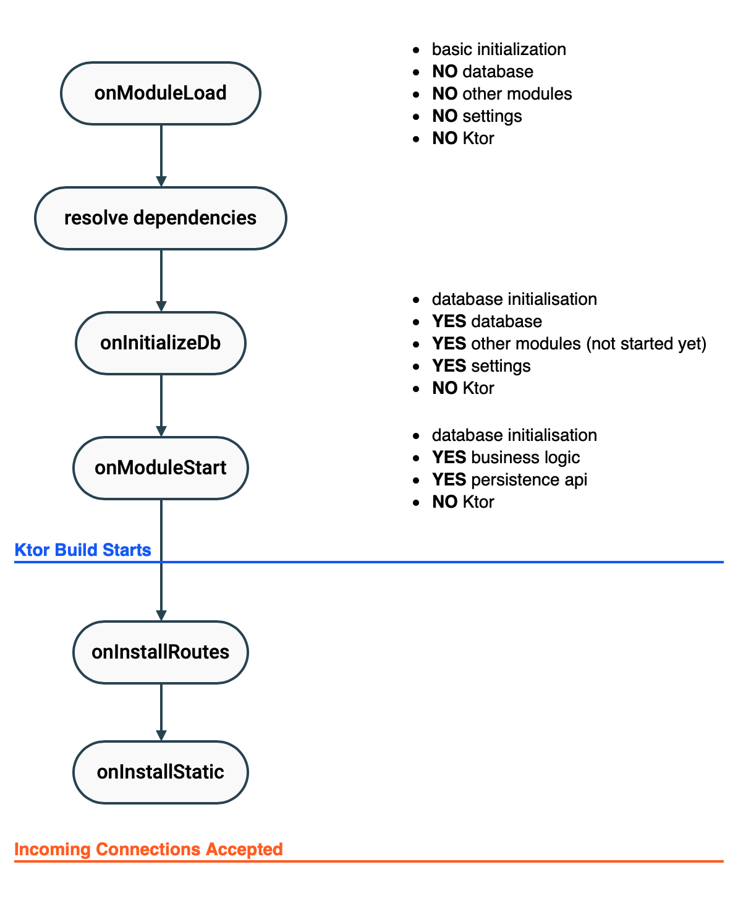

# Modules

Modules are the building blocks of the application. When you decide the functions
your application provides, you make a list the modules you need for those functions.

Once you have the list, you can set up your application by:

- adding the modules programmatically, and/or
- adding the modules from the configuration (JVM).

You can have modules on any node, frontend and backend both works. This makes
it possible to use common code.

## Add Programmatically

To add modules programmatically, use the `modules` global variable and simply
add the modules like this.

```kotlin
modules += SimpleExampleBl()
```

## Add From Configuration (JVM)

Add the module to the configuration file (etc/stack.server.yaml) as
the example below shows.

```
modules:
  - zakadabar.site.backend.Module
  - zakadabar.site.backend.Module2
```

## Module Bundles

Module bundles pack other modules together. This makes installation and configuration
easier.

Most libraries provide a module bundle class, so you can add the library to the application
easily, like this:

```kotlin
modules += ExampleModuleBundle()
```

To write a module bundle:

- Create an object that implements the interface [CommonModule](/core/core/src/commonMain/kotlin/zakadabar/stack/module/CommonModule.kt).
- Use the `onModuleLoad` function to add modules that are part of the bundle.

```kotlin
@PublicApi
object Module : CommonModule {
    
    override fun onModuleLoad() {
        modules += Example1Bl()
        modules += Example2Bl()
    }
    
}
```

## Module Lifecycle

This picture summarizes the module startup sequence when running 



### onModuleLoad

Perform only basic initialization in `onModuleLoad`.

### onInitializeDb

First time DB initialization and DB upgrades (if necessary).

### onModuleStart

Called after:

- loaded all modules with `onModuleLoad` executed
- resolved all module dependencies
- initialized the database: `onInitializeDb` executed for all modules
- settings are available (when SettingBl is added)

### onInstallRoutes (RoutedModule only)

This function adds the routes to Ktor. Most backends delegate setting
the routes to their `router`. See [Routing](../backend/Routing.md) for more information.

### onInstallStatic (RoutedModule only)

Add static resources to Ktor. It provides an easy way to register directories for static service. Check
[ContentBackend](/core/core/src/jvmMain/kotlin/zakadabar/stack/backend/custom/ContentBackend.kt)
for an example.

## Dependencies

A module can declare a dependency on another module. The `module` helper function
creates a delegate that provides an instance of the type parameter of the function.

```kotlin
val secondModule by module<SecondModule>()
```

After this declaration `secondModule` is an actual instance of `SecondModule`. You
can call its functions, access its properties.

During system startup the  function of 
[ModuleStore.resolveDependencies](/core/core/src/commonMain/kotlin/zakadabar/stack/module/ModuleStore.kt)
tries to resolve all module dependencies and throws an exception when there are missing non-optional
dependencies.

### Optional Dependencies

There are two ways to make dependencies optional:

- do it right: use the `optionalModule` function to declare the dependency
- hack it out: turn a mandatory dependency optional

You can do these anywhere, but it has to be done before `resolveDependencies` is called.

#### Declare a Dependency as Optional

Use the `optionalDependency` function to declare an optional dependency. In this
case the variable will be nullable, and you have to handle the cases when the
dependency is missing:

```kotlin
val provider2 by optionalModule<ProviderModule2>()

fun doSomething() {
    // you could use provider2?.doSomethingElse()
    provider2?.let { it.doSomethingElse() }
}
```

This is the preferred way as the code that uses this dependency won't compile
until you cover all cases.

#### Turn a Mandatory Dependency Optional

You can turn a mandatory dependency optional. Use this way only when you are 
not in position to do it right (see above).

Turning a mandatory dependency optional will make `resolveDependencies` finish 
without an error, but you may face runtime errors if you call functions that would
use this dependency.

```kotlin
modules.dependencies<ConsumerModule,ProviderModule>().optional = true
```

This way exists because sometimes you might not be in position to change the
provider module itself, you have to use it as it is.

### Dependency Resolution Failures

Dependency resolution throws `IllegalArgumentException`  when it is not able to
resolve the dependencies:

```text
2021-08-05 08:00:48.168565Z [INFO ]  loaded module zakadabar.cookbook.module.optional.ConsumerModule@1c2c22f3
2021-08-05 08:00:48.168565Z [ERROR]  unable to resolve dependency from zakadabar.cookbook.module.optional.ConsumerModule.provider1 to ProviderModule1 
2021-08-05 08:00:48.168565Z [INFO ]  unable to resolve optional dependency from zakadabar.cookbook.module.optional.ConsumerModule.provider2 to ProviderModule2 
Exception in thread "main" java.lang.IllegalStateException: module dependency resolution failed
	at zakadabar.stack.module.ModuleStore.resolveDependencies(ModuleStore.kt:116)
	at zakadabar.cookbook.module.optional.MainKt.main(main.kt:15)
```

## Internals

### Module Store

The application uses [ModuleStore](/core/core/src/commonMain/kotlin/zakadabar/stack/module/ModuleStore.kt)
instances to store modules.

The default module store is created automatically and assigned to the global variable `modules`.

Most applications does not need another module store, but it is possible to create, start, stop, etc.
more.

### Module Startup Buckets

[ModuleStartupBuckets](/core/core/src/commonMain/kotlin/zakadabar/stack/module/ModuleStartupBucket.kt) define 
the order in which modules start and stop.
[ModuleStore](/core/core/src/commonMain/kotlin/zakadabar/stack/module/ModuleStore.kt)
contains the list of buckets in the `buckets` property.

Buckets are ordered by their `order` property: lower the order, earlier the modules 
in that bucket start.

There are pre-defined buckets, started in this order:

- `BOOTSTRAP` modules needed for other modules to load properly, SQL providers for example
- `DEFAULT` normal business level modules, this is the default bucket
- `PUBLISH` modules that accept incoming connections, Ktor for example
- `STEADY` modules to be started after the system becomes steady

When you add a module to a store, the store goes over the buckets (from lowest oder
to highest) and calls the `selector` function of each bucket. If the selector
returns with `true` the module is added to the given bucket.

The `DEFAULT` bucket is an exception, it is excluded from the `selector` mechanism.
The store adds a module to the `DEFAULT` bucket when the selector all other buckets
returned with `false`.

You can specify one of the pre-defined buckets for a module by adding one of
the bucket selecting interfaces:

```kotlin
class ExampleBootstrapModule : CommonModule, BootstrapBucket
class ExamplePublishModule : CommonModule, PublishBucket
class ExampleSteadyModule : CommonModule, SteadyBucket
```

To add a new bucket, simply add the instance to the module store as below:

```kotlin
modules += ModuleStartupBucket(100) { it is ExampleBucketInterface }
```

