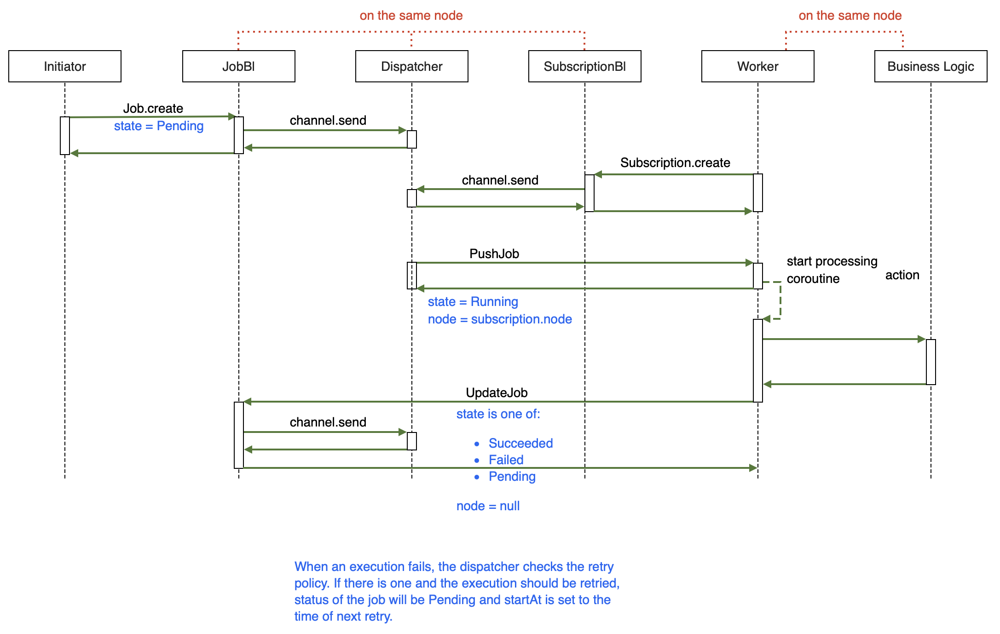

# Library: Schedule

Schedules and executes jobs in single or multi-node environment.

## Basics

This module defines two node types:

- dispatcher: manages jobs, sends them to workers for execution
  - [JobBl](/lib/schedule/src/jvmMain/kotlin/zakadabar/lib/schedule/business/JobBl.kt)
  - [SubscriptionBl](/lib/schedule/src/jvmMain/kotlin/zakadabar/lib/schedule/business/SubscriptionBl.kt)
  - [Dispatcher](/lib/schedule/src/jvmMain/kotlin/zakadabar/lib/schedule/business/Dispatcher.kt) - part of JobBl, one dispatcher for each (`actionNamespace`, `actionType`) pair
- worker: calls actual business logic modules to execute jobs, sends back the results to the dispatcher
  - [WorkerBl](/lib/schedule/src/jvmMain/kotlin/zakadabar/lib/schedule/business/WorkerBl.kt) - bridge between the dispatcher and business logic
  - business logic - actual action execution

In a typical setup you have one dispatcher and many workers.

Workers create [Subscriptions](/lib/schedule/src/commonMain/kotlin/zakadabar/lib/schedule/data/Subscription.kt)
to tell the dispatcher that they are ready to work.

The dispatcher provides CRUD for jobs and sends them to available workers for execution.

### Job

A [Job](/lib/schedule/src/commonMain/kotlin/zakadabar/lib/schedule/data/Job.kt) is
a managed action execution. Basically a simple action call with the following features:

- starts at a given time (or after)
- may be retried automatically after a failure (if retry policy allows)
- can be dispatched to other nodes
- the result of the action execution is saved

This picture summarizes the life of a job:



### API

Consumers of the schedule service use:

- [Job](/lib/schedule/src/commonMain/kotlin/zakadabar/lib/schedule/data/Job.kt) CRUD
- [RequestJobCancel](/lib/schedule/src/commonMain/kotlin/zakadabar/lib/schedule/data/RequestJobCancel.kt) action

Workers use:

- [Subscription](/lib/schedule/src/commonMain/kotlin/zakadabar/lib/schedule/data/Subscription.kt) CRUD
- [JobProgress](/lib/schedule/src/commonMain/kotlin/zakadabar/lib/schedule/data/JobProgress.kt) action
- [JobCancel](/lib/schedule/src/commonMain/kotlin/zakadabar/lib/schedule/data/JobCancel.kt) action
- [JobSuccess](/lib/schedule/src/commonMain/kotlin/zakadabar/lib/schedule/data/JobSuccess.kt) action
- [JobFail](/lib/schedule/src/commonMain/kotlin/zakadabar/lib/schedule/data/JobFail.kt) action

JobBl uses:

- [PushJob](/lib/schedule/src/commonMain/kotlin/zakadabar/lib/schedule/data/PushJob.kt) action

The default job store uses SQL to store the jobs.

## Recipes

- [Submit a Job](/doc/cookbook/schedule/submit/recipe.md)

## Setup

**common**

1. add the gradle dependency

**backend**

1. add the dispatcher modules to your server configuration, for details see [Modules](../../common/Modules.md)
2. add a worker module(s) to your server configuration, for details see [Modules](../../common/Modules.md)
3. add configuration files for the workers, name of the configuration file has to be <worker-name.yaml> (check)

**frontend**

For administrative purposes, you can add [JobCrud](/lib/schedule/src/jsMain/kotlin/zakadabar/lib/schedule/JobCrud.kt) to your
browser frontend.

### Common

#### gradle

```kotlin
implementation("hu.simplexion.zakadabar:schedule:$stackVersion")
```

### Backend

#### Add Module

```kotlin
zakadabar.lib.schedule.install()
modules += WorkerBl("worker1")
modules += WorkerBl("worker2")
```

#### Set Configuration Files

The example file below (named `worker1.yaml` as it is for `worker1`) is for a single node configuration. In this case
the dispatcher and the worker are on the same node.

The `local: true` means that the worker and the dispatcher runs in the same VM and there is no need for HTTP/HTTPS.
At the moment this is the only supported option. See [Comm](/doc/guides/common/Comm.md) for details.

`scheduleAccount` is the account used:
- by the workers to send job statuses to the dispatcher
- by the dispatcher to push jobs to the worker

```text
dispatcherComm:
  local: true
workerComm:
  local: true
scheduleAccount: "so"
```

## Database

The module uses SQL for data persistence. At first run it creates these SQL objects automatically.

| Table                   | Content        |
|-------------------------|----------------|
| `schedule_job`          | Jobs.          |
| `schedule_subscription` | Subscriptions. |