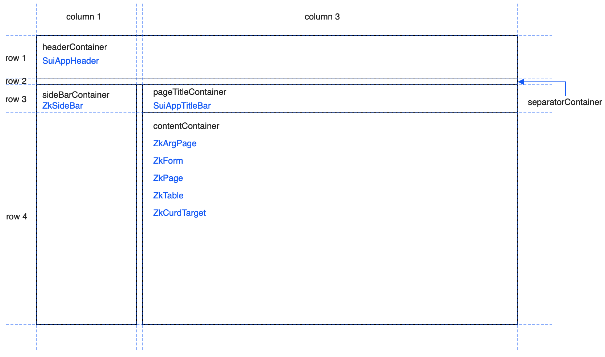

# Library: Soft UI

A UI theme inspired by [Soft UI](https://www.creative-tim.com/product/soft-ui-dashboard-react) from [Creative Tim](https://www.creative-tim.com/)

<div data-zk-enrich="Note" data-zk-flavour="Warning" data-zk-title="Mixing Zk and Sui themes">

If you want to change between Zk and Sui themes on the same page, you have to refresh the page
after the theme change.

The "in-place" theme switch works only when the themes use the same styles which is not true between
Zk and Sui, therefore the switch does not work without refresh.

</div>

## Setup

**common**

1. add the gradle dependency

**browser**

1. call the install function from `main.kt`
2. use the soft ui themes in `initTheme`

### Common

#### gradle

```kotlin
implementation("hu.simplexion.zakadabar:softui:$stackVersion")
```

### Browser

```kotlin
fun main() {

  application = ZkApplication()

  zakadabar.softui.browser.install()
  
  io {

    with(application) {

      initSession()

      initTheme(SuiLightTheme(), SuiDarkTheme())

      initLocale(strings, defaultLocale = "en")

      initRouting(Routing())

      run()

    }

  }

}
```

## Default Layout

The [SuiDefaultLayout](/lib/softui/src/jsMain/kotlin/zakadabar/softui/browser/layout/SuiDefaultLayout.kt)
class provides the default layout for the theme. The structure of the layout is shown below.

<div data-zk-enrich="Note" data-zk-flavour="Success" data-zk-title="">

The theme uses box shadows, so you have to give enough space around the components
or the shadows will be clipped.

</div>



## App Title Bar

The app title bar (class [SuiAppTitleBar](/lib/softui/src/jsMain/kotlin/zakadabar/softui/browser/titlebar/SuiAppTitleBar.kt) is between the header and the content area.
This bar contains the page title and the context actions (if there are any).

Padding of the title bar follows the page padding: 

- 20 pixels for large screens,
- 8 pixels for medium and small screens.

## Page Padding

Page styles `SuiPageStyles.fixed` and `SuiPageStyles.scollable` add padding to let the
box shadows shown.

The padding is:

- 20 pixels for large screens,
- 8 pixels for medium and small screens.


