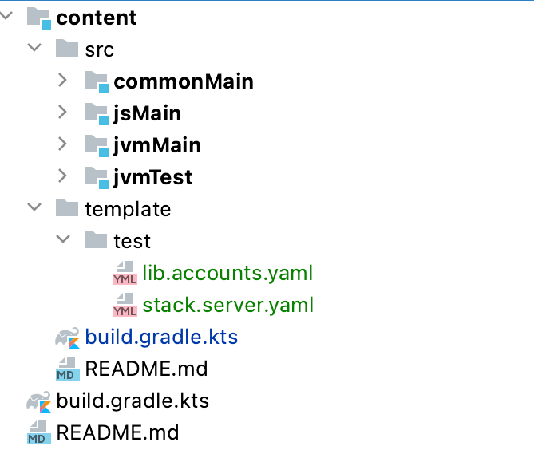

# Backend Testing

## API testing

The following setup lets you test API with:

- actual Ktor engine,
- H2 database,
- JVM client.

To create the environment for your tests:

1. add configuration files
1. add a test server setup
1. add a companion to your test class

### Gradle Dependencies

```kotlin
sourceSets["commonTest"].dependencies {
    implementation(kotlin("test-common"))
    implementation(kotlin("test-annotations-common"))
    implementation(kotlin("test-junit"))
}

sourceSets["jvmTest"].dependencies {
    implementation("io.ktor:ktor-server-netty:$ktorVersion")
    implementation("com.h2database:h2:1.4.200")
}
```

### Configuration Files

The following picture shows how to add the configuration files for your tests.



**lib.accounts.yaml** 

- Password of "so" account is "so".

```yaml
initialSoPassword: so
```

**stack.server.yaml**

- H2 in-memory database.
- Ktor runs on 8888.

```yaml
database:
  driverClassName: org.h2.Driver
  jdbcUrl: "jdbc:h2:mem:"
# Use this to save the DB for inspection. Remember to delete it before runs!
#  jdbcUrl: "jdbc:h2:./app/var/db"
  username: test
  password: Almafa.12

traceRouting: false
staticResources: ./var/static

ktor:
  port: 8888
```

### Test Class Without Authorization

Add a companion object to your test class extending [TestCompanionBase](/core/core-core/src/jvmMain/kotlin/zakadabar/stack/backend/testing/TestCompanionBase.kt).

[TestCompanionBase](/core/core-core/src/jvmMain/kotlin/zakadabar/stack/backend/testing/TestCompanionBase.kt):

- create and start a test Ktor Server with a test H2 instance
- set `CommBase.baseUrl` to the created Ktor instance

In the tests you can work just as you would do in a frontend module.

```kotlin
import kotlinx.coroutines.runBlocking
import org.junit.AfterClass
import org.junit.BeforeClass
import org.junit.Test
import zakadabar.stack.backend.server
import zakadabar.stack.backend.testing.TestCompanionBase
import zakadabar.stack.util.default

class MyBlTest {

    companion object : TestCompanionBase() {

        override fun addModules() {
            server += MyBl
        }

        override fun onAfterStarted() {
            // this code runs after the server has been started
            // optional
        }
        
        @BeforeClass
        @JvmStatic
        override fun setup() = super.setup()

        @AfterClass
        @JvmStatic
        override fun teardown() = super.teardown()

    }
    
    @Test
    fun testMyFunction() = runBlocking {

        val testBo = default<MyBo> {  }.create()
        
        // ... more test code follows ...
    }
    
}
```

### Test Class With Authorization

For this you need to add the dependency for `Lib: Accounts`.

Add a companion object to your test class, extending [AuthTestCompanionBase](/lib/accounts/src/jvmMain/kotlin/zakadabar/lib/accounts/backend/testing/AuthTestCompanionBase.kt).

[AuthTestCompanionBase](/lib/accounts/src/jvmMain/kotlin/zakadabar/lib/accounts/backend/testing/AuthTestCompanionBase.kt):

- create and start a test Ktor Server with a test H2 instance
- set `CommBase.baseUrl` to the created Ktor instance
- install the `Lib: Accounts` plug-and-play module
- adds a [SimpleRoleAuthorizerProvider](/core/core-core/src/commonMain/kotlin/zakadabar/stack/backend/authorize/SimpleRoleAuthorizerProvider.kt) with `all = roles.siteMember`.
- performs a login for the `so` account

In the tests you can work just as you would do in a frontend module.

```kotlin
class MyBlTest {

    companion object : AuthTestCompanionBase() {

        override fun addModules() {
            super.addModules() // to install lib:accounts
            server += MyBl
        }

        override fun onAfterStarted() {
            super.onAfterStarted() // to perform login
            // this code runs after the server has been started, optional
        }
        
        @BeforeClass
        @JvmStatic
        override fun setup() = super.setup()

        @AfterClass
        @JvmStatic
        override fun teardown() = super.teardown()

    }
    
    @Test
    fun testByLocalizedPath() = runBlocking {

        val testBo = default<MyBo> {  }.create()
        
        // ... more test code follows ...
    }
    
}
```

### Troubleshooting

This usually means that the configuration files are missing:

```text
FAILURE: Build failed with an exception.
* What went wrong:
Execution failed for task ':core:jvmTest'.
> Process 'Gradle Test Executor 1' finished with non-zero exit value 1
  This problem might be caused by incorrect test process configuration.
```

