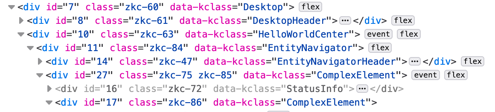

# Productivity Tips

## We Write Documentation

What's more, we try to write **helpful** documentation.

Check the in-line documentation when you want to find out some detail, keyword, function etc.

I - for example - tend to forget which one is "justify-content" and which one is "align-items".

So, when you hover over "justifyContent" you'll see something like this:


## Finding Bugs

* Check the [Knowledge Base](../knowledge-base/README.md)
* Check GitHub issues
* Read on

### SimpleElement addKClass

If you set addKClass in SimpleElement to `true` you will see the Kotlin class of your elements in the browser inspector.

Best place to add this setting is the application bootstrap.

```
SimpleElement.addKClass = true
```



### Trace Ktor Routing

To trace Ktor routing set `tracerouting` in `zakadabar-server.yaml` to true:

```yaml
traceRouting: true
```

## IntelliJ IDEA

* Use Double-Shift to find files fast.
* Use Command-B or Ctrl-B often. As we use Kotlin for everything it works very well.
* Use "Mark as Excluded" and "Show Excluded Files" to hide the boilerplate.