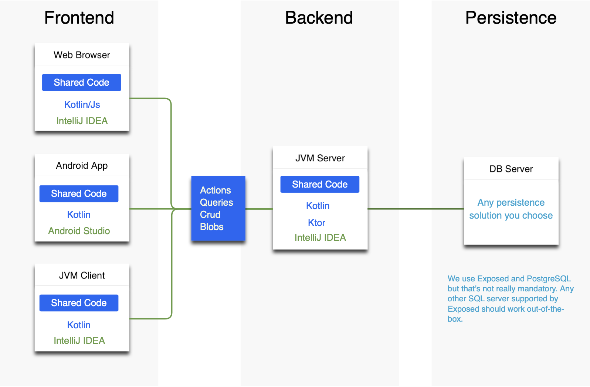

# Zakadabar

Zakadabar is a software library that helps you concentrate on the business aspect of your application.

## Cards

### Write Once Use Everywhere

Write API data models, schemas, logic that is shared between all your targets: server, browser, mobile. It's enough to
code an API once, isn't it?

### Let the Machine Work

Write what's needed, let the compiler link it all together. There are so many parts that are trivial. You can just skip
them.

### Walk Your Way

Tools, ready-to-use parts, blueprints:
that's us. No restrictions, no boxes to fit in. Your application, your choice.

### Go Till It's Ready

From start to finish: we give you templates, examples, how-tos. In the end you'll have an enterprise grade software
system.

## Features

## General Structure

