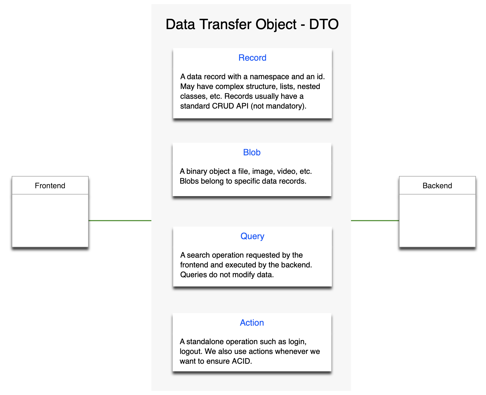

# Data

| Term | Explanation |
| ---- | ---- |
| BLOB | A binary object, files, images, videos. |
| Comm | An object on the frontend that provides easy ways to communicate with the backend. |
| CRUD | Mnemonic for the basic record operations: create, read, update, delete. |
| DAO | A Data Access Object used on the backend that makes handling the data easier, the stack uses Exposed DAOs. |
| DTO | A Data Transfer Object for transferring data between the frontend and the backend. |
| Schema | Collection of validation rules to check validity of data. |
| Table | An SQL table for persistence, the stack uses Exposed tables, but you can use whatever persistence you want actually. |

This image summarizes DTO types the stack handles.



## Important points

* all DTOs should be in `commonMain`, this ensures that frontend and backend uses the same API
* pay attention to the binding of Queries and Actions, they need a backend to work
* do not copy and paste directories in IDEA, the package names will be wrong and all hell will get lose, create the
  directory and then copy files

## Write a Record DTO

To write a record DTO and make it accessible from the frontend:

- write the DTO class
  - [SpeedDto](../../demo/demo/src/commonMain/kotlin/zakadabar/demo/data/speed/SpeedDto.kt)
- write the DTO frontend
  - [crud](../../demo/demo/src/jsMain/kotlin/zakadabar/demo/frontend/pages/speed/Speeds.kt) (for automatic crud routing)
  - [form](../../demo/demo/src/jsMain/kotlin/zakadabar/demo/frontend/pages/speed/Form.kt)
  - [table](../../demo/demo/src/jsMain/kotlin/zakadabar/demo/frontend/pages/speed/Table.kt)
  - [routing](../../demo/demo/src/jsMain/kotlin/zakadabar/demo/frontend/Routing.kt)
  - [sidebar](../../demo/demo/src/jsMain/kotlin/zakadabar/demo/frontend/SideBar.kt)
- write the DTO backend
  - [table](../../demo/demo/src/jvmMain/kotlin/zakadabar/demo/backend/speed/SpeedTable.kt)
  - [dao](../../demo/demo/src/jvmMain/kotlin/zakadabar/demo/backend/speed/SpeedDao.kt)
  - [backend](../../demo/demo/src/jvmMain/kotlin/zakadabar/demo/backend/speed/SpeedBackend.kt)

## Use a Record DTO

On the
frontend [RecordDtoCompanion](../../core/src/commonMain/kotlin/zakadabar/stack/data/record/RecordDtoCompanion.kt)`.comm`
provides easy access to basic record operations.

Check [demo-jvm-client](../../demo/demo-jvm-client/src/jvmMain/kotlin/zakadabar/demo/frontend/Main.kt) for a working
example.

```kotlin
val iAmFast = SpeedDto.default {
  name = "nigh uncatchable"
  value = 100
}.create()

val iAmFaster = SpeedDto.read(iAmFast.id)

iAmFaster.value = 1000

iAmFaster.update()

iAmFaster.delete()

SpeedDto.all().forEach {
  // do something
}
```

## Write a Query

To write a query DTO:

- write the DTO classes:
  - [SearchShipsQuery](../../demo/demo/src/commonMain/kotlin/zakadabar/demo/data/ship/SearchShipsQuery.kt)
  - [SearchShipsResult](../../demo/demo/src/commonMain/kotlin/zakadabar/demo/data/ship/SearchShipsResult.kt)
- add the query to the DTO companion that provides communication
  - [ShipDto](../../demo/demo/src/commonMain/kotlin/zakadabar/demo/data/ship/ShipDto.kt)
- add the query to the DTO backend:
  - [backend](../../demo/demo/src/jvmMain/kotlin/zakadabar/demo/backend/ship/ShipBackend.kt)
    - add a `route.query` call to `installRoutes`
    - add a `query` function with the query DTO class as second parameter and the result DTO class as return type

## Use a Query

Call the `execute` method:

```kotlin
SearchShipsQuery().execute().forEach {
    println(it)
}
```

## Write an Action

To write an action DTO:

- write the DTO classes:
  - [ShootAtShipAction](../../demo/demo/src/commonMain/kotlin/zakadabar/demo/data/ship/ShootAtShipAction.kt)
- add the action to the DTO companion that provides communication
  - [ShipDto](../../demo/demo/src/commonMain/kotlin/zakadabar/demo/data/ship/ShipDto.kt)
- add the action to the DTO backend:
  - [backend](../../demo/demo/src/jvmMain/kotlin/zakadabar/demo/backend/ship/ShipBackend.kt)
    - add a `route.action` call to `installRoutes`
    - add an `action` function with the action DTO class as second parameter and the result DTO class as return type

## Use an Action

Call the `execute` method:

```kotlin
val result = ShootAtShipAction().execute()

// We have a "success" property here because result type of ShootAtShipAction is an ActionStatusDto.
// If you use another result type, you may not have the result field here.

if (result.success) {
    // something something
}
```

## Data Validation

Data validation uses [DtoSchema](../../../core/src/commonMain/kotlin/zakadabar/stack/data/schema/DtoSchema.kt)
definitions.

DtoSchema focuses more on programmer convenience than on performance. It is not really suitable for validating large
batches of data like thousands of transactions from XML files.

In practice, you use the validation when:

* the user fills a form, and you want to know if everything is OK
* the frontend sends some data to the backend, and you want to check that everything is OK

Additionally, you need the information about what's wrong when the user enters invalid data, this needs a properly
formatted, translated message.

Technically if you follow the guidelines you should not be able to send data from the client that fails to validate on
the server because you've already validated it on the client.

This of course does not free you from validation on the server side, it just means that you usually don't have to worry
much about it as a developer.

## Write a Schema

- override the schema variable of the DTO class
  - [SpeedDto](../../demo/demo/src/commonMain/kotlin/zakadabar/demo/data/speed/SpeedDto.kt)

## Use a Schema

[ZkForm](../../core/src/jsMain/kotlin/zakadabar/stack/frontend/builtin/form/ZkForm.kt) validates the dto automatically.

To validate manually:

```kotlin
val dto: ShipDto = default { }
if (! dto.isValid) {
    println("default ship DTO is actually invalid")
}
```

To inspect fails:

```kotlin
val dto: ShipDto = default { }
dto.schema().validate().fails.forEach {
    println("${it.key} ${it.value}")
}
```

## Serialization

Serialization of DTOs use kotlinx.serialization. Just add the `@Serializable`
annotation in front of the DTO class.

When serializing kotlinx.datetime data types the appropriate annotation is needed:

```kotlin
@file:UseSerializers(
  InstantAsStringSerializer::class,
  OptInstantAsStringSerializer::class
)
```
