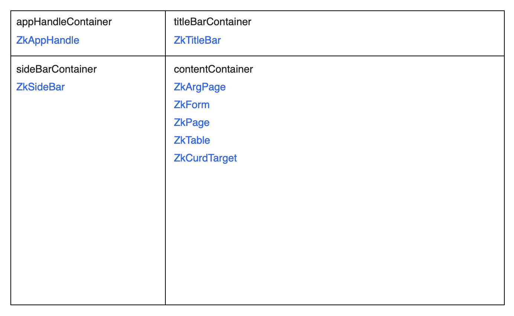

# Layout

An application may have any number of layouts. A layout defines the general structure of the page.

* Layout classes
  extend [ZkAppLayout](../../../../../core/src/jsMain/kotlin/zakadabar/stack/frontend/application/ZkAppLayout.kt).
* There is one active layout at one time, others are in the DOM but hidden.
* [ZkAppRouting](../../../../../core/src/jsMain/kotlin/zakadabar/stack/frontend/application/ZkAppRouting.kt) handles
  layout changes

There are two pre-defined layouts:

* [ZkFullScreenLayout](../../../../../core/src/jsMain/kotlin/zakadabar/stack/frontend/builtin/layout/ZkFullScreenLayout.kt)
* [ZkDefaultLayout](../../../../../core/src/jsMain/kotlin/zakadabar/stack/frontend/builtin/layout/ZkDefaultLayout.kt)

## The Default Layout

This picture shows the structure of ZkDefaultLayout. Blue class names are the components for the given area.

## Application Title

Pages, tables and forms use `ZkApplication.title` to set the title bar.

Default title bar
implementation: [ZkTitleBar](../../../../../core/src/jsMain/kotlin/zakadabar/stack/frontend/builtin/titlebar/ZkTitleBar.kt)

The title bar has 4 areas:

* sidebar show button (hidden by default)
* title - title of the page currently shown
* context elements - actions that belong to the current page like table search
* global elements - global actions, shown all the time

All high level elements (ZkPage, ZkArgPage, ZkForm, ZkTable) have the following fields:

* `appTitle` - boolean, when true sets the title bar content (default = true)
* `title` - string, when set this element is assigned to `ZkApplication.title`
* `titleText` - string, when set, a new `ZkAppTitle` instance is created and that instance is assigned
  to `ZkApplication.title`