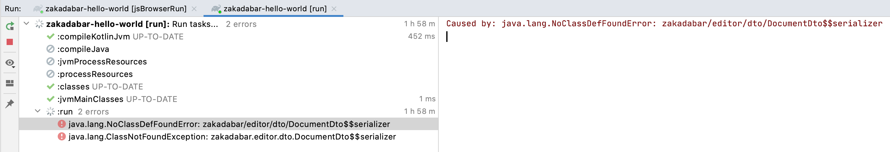

# Knowledge Base

## I can't find the CSS, HTML, JavaScript files, where are they?

In the Stack, there are none. For all those things we use Kotlin based solutions. JavaScript is obvious, the Kotlin compiler takes care of that.

We handle CSS with [CssStyleSheet](../../core/src/jsMain/kotlin/zakadabar/stack/frontend/util/css.kt).

## Focus on Inputs

If you try to focus on a form input field automatically, and it does not work put the focus code into an animation frame like this:

```kotlin
window.requestAnimationFrame {
    dto::accountName.find().focus()
}
```

## Running the Webpack devServer in Continuous Mode

* Use the "jsBrowserRun" manually first.
* This will add a run configuration.
* Edit the run configuration and add "--continuous" to "Arguments".

## Backend Throws NoClassDefFoundError

This is mostly because the compiler replaced the .jar file under the JVM, and it did not realize what's happening.

Restart the backend.



## Exposed

### No Transaction in Context

`Caused by: java.lang.IllegalStateException: No transaction in context.`

Means you forgot to add the transaction block for Exposed:

```kotlin
fun query(executor: Executor, query: ExampleQuery) {
    // this throws the exception
}
```

vs.

```kotlin
fun query(executor: Executor, query : ExampleQuery) = transaction {
    // this works
}
```

### Loading from Left Join

When loading from a left join and there is no record to join with you may get an exception like this:

```text
java.lang.NullPointerException: Parameter specified as non-null is null: method zakadabar.discussions.dto.PostDto.<init>, parameter relations
	at zakadabar.discussions.dto.PostDto.<init>(PostDto.kt)
```

The solution is use this syntax:

```koltin
TopicDto(
    relations = (it[RelationTable.relation] as String?) ?: ""
)
```

### Cannot Import Exposed "eq"

No idea why this happens, Just add the import manually:

```import org.jetbrains.exposed.sql.SqlExpressionBuilder.eq```

### NPM + Yarn lock - whatever wherever ...

```text
* What went wrong:
  Execution failed for task ':kotlinNpmInstall'.
>                 Process 'Resolving NPM dependencies using yarn' returns 1
> 
```

* Gradle Clean

### kotlinx.serializer stuff cannot be imported after Gradle clean

This happens if you commit with "organize imports" on. Add an `import kotlinx.serialization.*` to the files in error.